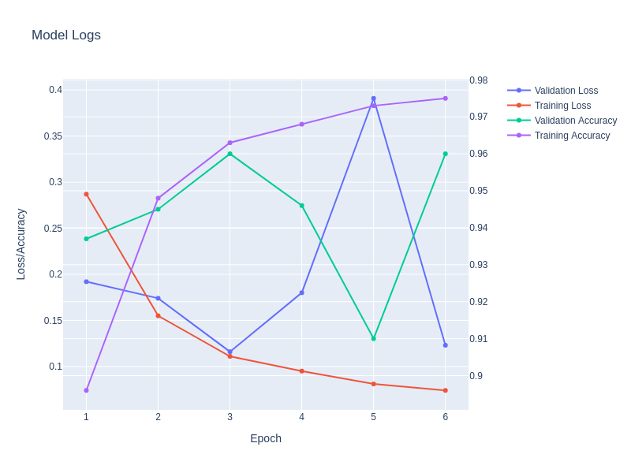
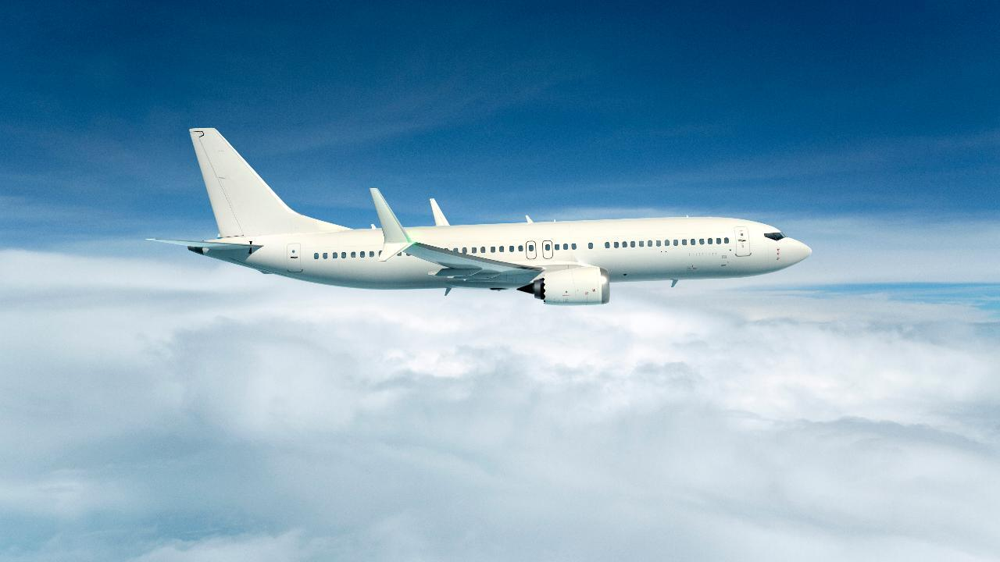

# Image Classification with CIFAR 10 Dataset

## Introduction

This very beginner friendly deep learning project for those trying to get into the world of deep learning. We are using the CIFAR 10 dataset to train a convolutional neural network to classify images.

## Dataset

Cifar 10 is a dataset of 60,000 32x32 color images in 10 classes. Each image is labeled with one of the 10 digits. It is a subset of the [ImageNet dataset](http://www.image-net.org/).

### Downloading the dataset

To download the dataset, you can use the following command:

```bash
sh download/download_cifar10.sh
```

### Unpickling the dataset

To unpickle the dataset, you can use the following command:

```bash
python data/unpickle_cifar10.py
```

## Usage

### Training

To train the network, you can use the following command and retrain model:

```bash
python main.py
```

Model will be saved as `model.pth` in the current directory.

Ps. There is no current support for training model on starting from current checkpoint, but it'll be easy to add.

### Testing

To test the network and reproduce the results, you can use the following command:

```bash
python test.py
```

- Results:
  
| epoch | train_loss | val_loss | train_acc | val_acc |
|-------|------------|----------|-----------|---------|
| 1     | 0.287      | 0.192    | 0.896     | 0.937   |
| 2     | 0.155      | 0.174    | 0.948     | 0.945   |
| 3     | 0.111      | 0.116    | 0.963     | 0.960   |
| 4     | 0.095      | 0.180    | 0.968     | 0.946   |
| 5     | 0.081      | 0.391    | 0.973     | 0.910   |
| 6     | 0.074      | 0.123    | 0.975     | 0.960   |



### Predict Custom Image

To predict the any image, you can use the following command:

```bash
python predict.py --fp <path to image>
```

If you don't specify the path to image, it'll select random image from test set. and will save the result as `prediction.png` in the docs directory.

## Examples

- Airplane:


```sh
> python predict.py --fp docs/plane.jpg

Most possible class: airplane
Probabilities: {'airplane': '0.89', 'automobile': '0.00', 'bird': '0.00', 'cat': '0.00', 'deer': '0.02', 'dog': '0.00', 'frog': '0.00', 'horse': '0.00', 'ship': '0.09', 'truck': '0.00'}
```

- Bird:


```sh
> python predict.py --fp docs/bird.png
Most possible class: bird
Probabilities: {'airplane': '0.06', 'automobile': '0.00', 'bird': '0.94', 'cat': '0.00', 'deer': '0.00', 'dog': '0.00', 'frog': '0.00', 'horse': '0.00', 'ship': '0.00', 'truck': '0.00'}
```


```sh
> python predict.py --fp docs/cat.jpeg
Most possible class: ship
Probabilities: {'airplane': '0.08', 'automobile': '0.08', 'bird': '0.19', 'cat': '0.13', 'deer': '0.00', 'dog': '0.00', 'frog': '0.11', 'horse': '0.00', 'ship': '0.37', 'truck': '0.03'}
```

# :astonished:

## Conclusion

It seems this is not very good model, probably dataset not have complicated pictures. However, it's very easy and fun to get started with deep learning with this dataset. I hope you enjoy it and find it useful.
